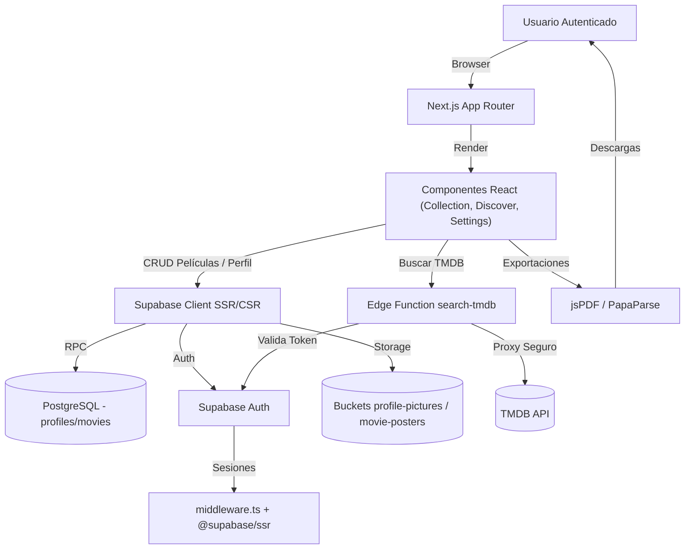

## Informe Técnico de Arquitectura
**RetroDex**

Este informe resume las decisiones técnicas, los componentes principales y la arquitectura de referencia del proyecto RetroDex, una aplicación especializada para coleccionistas de cine que combina datos públicos de TMDB con información privada almacenada en Supabase.

---

## 1. Stack Tecnológico

* **Lenguaje:** TypeScript (estricto, orientado a componentes reutilizables).
* **Framework Fullstack:** Next.js 16 (App Router + Server Actions).
* **UI & Estilos:** React 19, Tailwind CSS, componentes shadcn/ui sobre Radix.
* **Estado Asíncrono:** TanStack Query para sincronizar caché cliente/servidor.
* **BaaS:** Supabase (PostgreSQL + Auth + Storage + Edge Functions).
* **Exportaciones:** jsPDF (PDF) y PapaParse (CSV) para descargas offline.
* **Utilidades:** lucide-react (iconografía), @supabase/ssr para sesiones seguras.

---

## 2. Justificación del Stack

1. **Next.js + React:** Permiten SSR/SSG selectivo, layouts anidados y segmentación por rutas (`/(auth)` vs `/(app)`), reduciendo el TTFB y simplificando la protección de páginas privadas.
2. **TypeScript:** Garantiza contratos claros entre componentes (formularios, hooks, servicios Supabase) y minimiza errores en flujos críticos como autenticación o exportaciones.
3. **Supabase:** Provee autenticación gestionada, PostgreSQL con RLS y buckets públicos controlados, evitando implementar un backend personalizado para operaciones CRUD.
4. **Tailwind + shadcn/ui:** Aceleran la construcción de interfaces accesibles y consistentes, con variantes de componentes (`Button`, `Card`) alineadas al diseño oscuro del dashboard.
5. **TanStack Query:** Reutiliza la consulta inicial del servidor en el cliente, habilitando refetch selectivo y optimismo al modificar películas o filtros.
6. **Edge Function `search-tmdb`:** Mantiene el token de TMDB fuera del navegador, valida la sesión Supabase antes de proxyar solicitudes y enriquece respuestas con géneros legibles.
7. **Librerías de exportación:** jsPDF resuelve los reportes centrados en formato carta apaisado; PapaParse genera CSVs compatibles con hojas de cálculo sin escribir parseadores manuales.

---

## 3. Componentes y Flujos Clave

| Módulo | Descripción |
| --- | --- |
| **Autenticación** | Server Actions (`login/actions.ts`) gestionan altas/bajas, disparan el trigger `handle_new_user` y mantienen sesiones mediante `@supabase/ssr` en `middleware.ts`. |
| **Colección (Home)** | `CollectionDashboard` hidrata la consulta inicial de películas, muestra métricas y expone `CollectionGrid` con búsqueda, filtros, layouts y CRUD optimista sobre la tabla `movies`. |
| **Discover** | Consume la Edge Function para listados (Popular, Top Rated, Upcoming) y búsquedas; evita duplicados comparando `tmdb_id` existentes en el caché local. |
| **Dashboard** | Visualizaciones con Recharts (líneas, barras, pie) basadas en la misma fuente de datos cacheada, destacando recuentos por estado y valor estimado. |
| **Settings** | Formulario de perfil, subida de avatar a `profile-pictures`, exportaciones PDF/JSON/CSV reutilizando un helper `getExportMovies`, y acción destructiva de logout. |
| **Storage Buckets** | `profile-pictures` y `movie-posters` con control por carpetas (`${auth.uid()}/archivo.ext`) y lectura pública. |

---

## 4. Datos y Seguridad

* **Tablas principales:** `profiles` (datos públicos del usuario) y `movies` (colección privada) con RLS activo (`auth.uid() = id` o `user_id`).
* **Tipos y validaciones:** Enum `movie_status` asegura valores válidos (`wishlist`, `owned`, `watched`).
* **Triggers:** `handle_auth_user_insert` crea la fila en `profiles` usando `raw_user_meta_data.username` al registrarse.
* **Storage Policies:** Solo usuarios autenticados pueden escribir dentro de su carpeta; la lectura es pública para simplificar la carga de imágenes.
* **Edge Lambda:** Antes de consultar TMDB verifica el JWT ante Supabase (`/auth/v1/user`), lo que bloquea tráfico anónimo.

### 4.1 Tablas de la base de datos

**public.profiles** (1:1 con `auth.users`)

| Columna | Tipo | Notas |
| --- | --- | --- |
| id | uuid | PK, coincide con `auth.users.id`. |
| username | text | Nombre visible; editable por el usuario. |
| avatar_url | text | URL pública al bucket `profile-pictures`. |
| created_at | timestamptz | Marca de creación (servida por Supabase). |
| updated_at | timestamptz | Última modificación del perfil. |

**public.movies** (colección privada por usuario)

| Columna | Tipo | Notas |
| --- | --- | --- |
| id | uuid | PK auto-generada. |
| profile_id | uuid | FK hacia `profiles.id` (alias de `auth.users.id`). |
| status | movie_status | Enum (`wishlist`, `owned`, `watched`). |
| tmdb_id | integer | Puede ser nulo si es registro manual. |
| title | text | Requerido. |
| release_year | integer | Requerido. |
| rating | integer | Rango 1-5, opcional. |
| personal_review | text | Comentario privado. |
| estimated_price | numeric | Usado para métricas de valor. |
| watched_at | timestamp | Marca de visionado. |
| synopsis | text | Resumen desde TMDB. |
| genres | jsonb | Lista de géneros (objetos `{ id, name }`). |
| tmdb_poster_path | text | Ruta relativa de TMDB. |
| user_poster_url | text | Imagen personalizada en `movie-posters`. |

**public.movie_status** (ENUM)

| Valor | Significado |
| --- | --- |
| wishlist | Pendiente de adquirir/ver. |
| owned | En posesión del usuario. |
| watched | Ya vista; habilita métricas de seguimiento. |

---

## 5. Diagrama de Arquitectura

---

## 6. Consideraciones Operativas

1. **Despliegue:** Next.js se compila en modo App Router; Supabase gestiona base de datos y funciones Edge. Variables sensibles (TMDB token, claves Supabase) viven en el entorno. 
2. **Observabilidad:** Se recomienda habilitar logging de Edge Functions y almacenamiento para auditar descargas masivas o errores de exportación.
3. **Escalabilidad:** TanStack Query y la paginación de Supabase reducen la presión sobre la base de datos; los buckets públicos permiten servir imágenes via CDN de Supabase.

---

## 7. Resumen

RetroDex equilibra una experiencia rica en cliente con controles estrictos de datos gracias a Supabase y TypeScript. El aislamiento entre datos públicos (TMDB) y privados (PostgreSQL con RLS) garantiza que la colección personal nunca abandone el entorno seguro, mientras que las exportaciones locales cubren la necesidad de respaldos offline para los coleccionistas.
